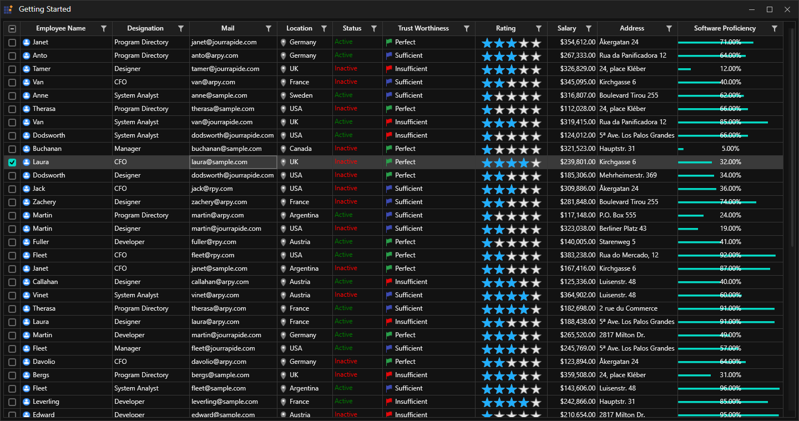

# How to change scrollbar mode using WPF SkinManager?

This sample loads [Datagrid](https://help.syncfusion.com/wpf/datagrid/getting-started) and [Chromeless Window](https://help.syncfusion.com/wpf/chromeless-window/getting-started) with compact windows 10 like scrollbar using SkinManager [ScrollBarMode](https://help.syncfusion.com/cr/wpf/Syncfusion.SfSkinManager.Theme.html#Syncfusion_SfSkinManager_Theme_ScrollBarMode) property.

